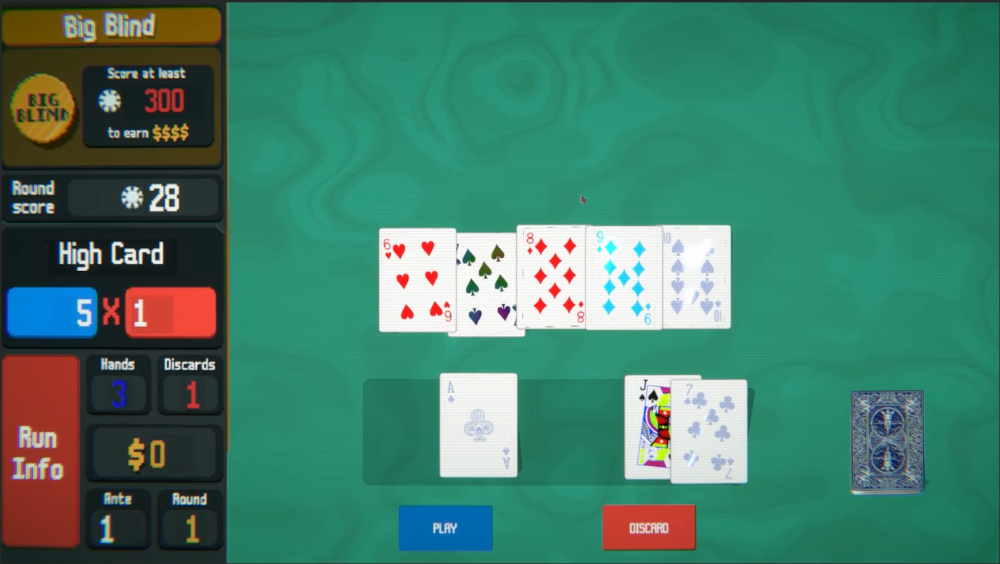

# Balatro Project

A Unity recreation of [Balatro](https://www.playbalatro.com/), the poker-based roguelike. The goal is to recreate Balatro's core gameplay mechanics and stylistic feel — playing and scoring poker hands against blind targets — as closely as possible.

Built as part of a Mobile Media & Game Development module at BNBU.
